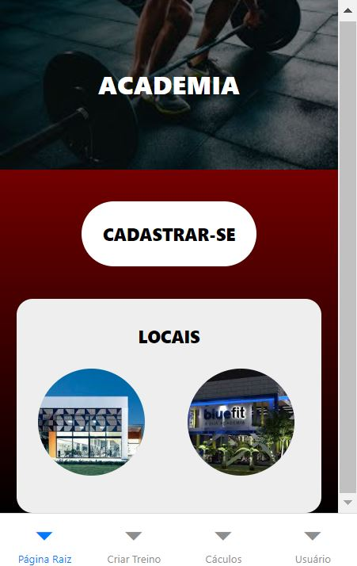
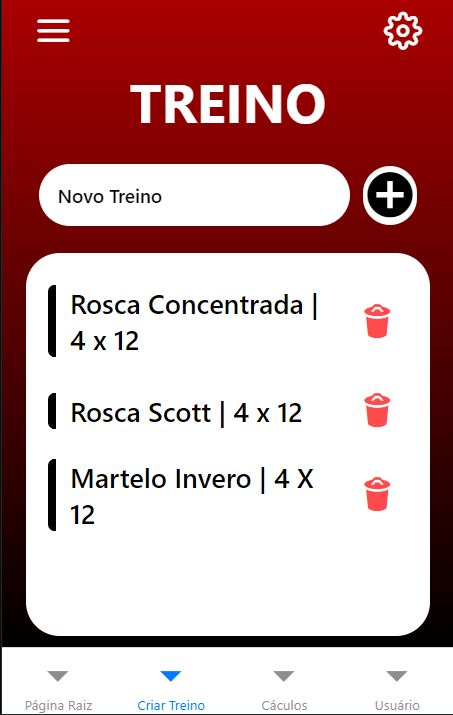
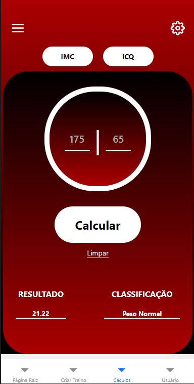
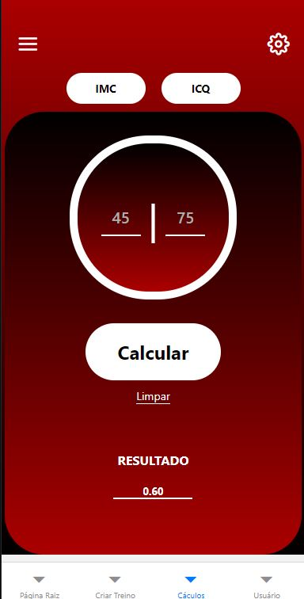
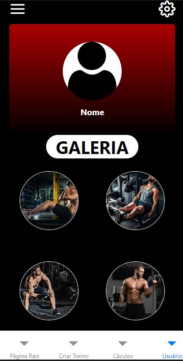

# Notas de aula

Curso: Tecnologia em Sistemas para Internet

Disciplina: Programação para Dispositivos Móveis I (2024-1)

Professor: Vinícius Maeda

---

### Comandos utilizados na aula

#### Criar um projeto React Native
```
npx create-expo-app --template blank meu-app-saude
```

#### Instalar o React Navigation
```
npm install @react-navigation/native
```

#### Instalar as dependências do React Navigation
```
npx expo install react-native-screens react-native-safe-area-context
```

#### Instalar o Bottom Tab Navigator
```
npm install @react-navigation/bottom-tabs
```

#### Iniciar o projeto
```
npx expo start 
```

#### Iniciar o projeto no Android
```
npx expo start --android
```


# Academia App 🏋️‍♂️

## Introdução 📖

Este projeto foi desenvolvido como um aplicativo mobile para anotar os treinos de academias. O aplicativo foi construído utilizando **React Native** com o auxílio do **Expo** para facilitar o desenvolvimento e a visualização do aplicativo no dispositivo físico. Ele possui uma navegação entre páginas usando o **Bottom Tabs Navigator**, permitindo fácil acesso às principais funcionalidades da aplicação. O objetivo do aplicativo é oferecer ao usuário uma interface simples e intuitiva para cadastrar-se na academia, criar treinos, calcular o índice de massa corporal (IMC) e o índice cintura-quadril (ICQ), e visualizar seus dados.

### Ferramentas Utilizadas 🛠️

- **Visual Studio Code (VSCode)**: Editor de código para o desenvolvimento do projeto.
- **Node.js**: Plataforma usada para executar o ambiente JavaScript do lado do servidor, necessária para rodar o Expo.
- **Expo**: Framework e plataforma utilizada para desenvolver, construir e rodar o aplicativo React Native.
- **React Native**: Framework usado para o desenvolvimento da interface mobile multiplataforma (Android e iOS).
- **Expo Go**: Aplicativo para visualizar o desenvolvimento em tempo real em um dispositivo físico.

### Dependências 📦
As principais dependências utilizadas no projeto incluem:

- `react-navigation` e `react-navigation-bottom-tabs`: Para gerenciar a navegação entre as páginas.
- `expo`: Para o gerenciamento do ciclo de vida da aplicação e execução em dispositivos.
- `react-native-gesture-handler` e `react-native-reanimated`: Utilizadas na navegação e animações.
- `expo-status-bar`: Para o gerenciamento da barra de status.
- Outras dependências podem ser encontradas no arquivo `package.json`.

## Desenvolvimento 🛠️

O aplicativo é composto por 4 telas principais, cada uma acessada por meio do **Bottom Tabs Navigator**.

### 1. **Home 🏠**



A tela inicial, nomeada **Home**, contém:
- Um título centralizado com o nome da academia, por exemplo, **"Academia XYZ"**.
- Um botão "Cadastre-se" que leva o usuário para a tela de cadastro.
- Algumas imagens ilustrativas das academias.

### 2. **Todo-List para Criar Treinos 📝**


Nesta página, o usuário pode:
- Criar e gerenciar seus treinos em um formato semelhante ao de um **todo-list**.
- A tela permite ao usuário adicionar exercícios aos treinos, editar e remover.

### 3. **Cálculo de IMC e ICQ 📊**
 

Esta página oferece ao usuário duas funcionalidades:
- **IMC (Índice de Massa Corporal)**: O usuário pode inserir seu peso e altura, e o aplicativo calculará automaticamente seu IMC.
- **ICQ (Índice Cintura-Quadril)**: O usuário insere suas medidas de cintura e quadril, e o aplicativo calcula o ICQ.
  
O resultado do cálculo será exibido na tela, juntamente com uma breve explicação sobre o índice, permitindo ao usuário interpretar melhor seu resultado.

### 4. **Página do Usuário (User) 👤**


Nesta tela, o usuário pode visualizar e editar seus dados pessoais:
- Informações como nome, idade e sexo estão disponíveis e editáveis.
- A interface é simples e direta, com campos de entrada que permitem ao usuário atualizar seus dados.

### Estrutura de Navegação 🔄
A navegação entre essas quatro páginas é gerenciada pelo **Bottom Tabs Navigator**, permitindo que o usuário alterne entre as funcionalidades de forma rápida e intuitiva.

## Conclusão 🎯

O aplicativo **Academia App** foi desenvolvido com o intuito de obtenção de nota da matéria "Programação de Dispositivos Móveis 1". Ele permite que o usuário se cadastre, organize seus treinos, calcule índices importantes como IMC e ICQ, e mantenha suas informações pessoais sempre atualizadas. 

Com a utilização de tecnologias modernas como **React Native** e **Expo**, o desenvolvimento foi feito de maneira eficiente, garantindo suporte para dispositivos Android e iOS de forma nativa. A interface com **Bottom Tabs** proporciona uma experiência de navegação fluida e amigável. Este projeto pode ser expandido futuramente com funcionalidades adicionais, como a integração com APIs para monitoramento de progresso em tempo real ou compartilhamento de treinos com amigos.

